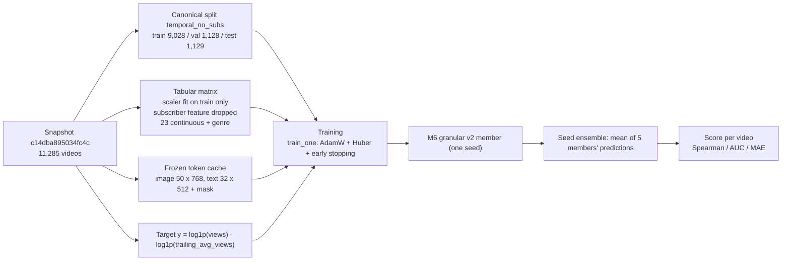
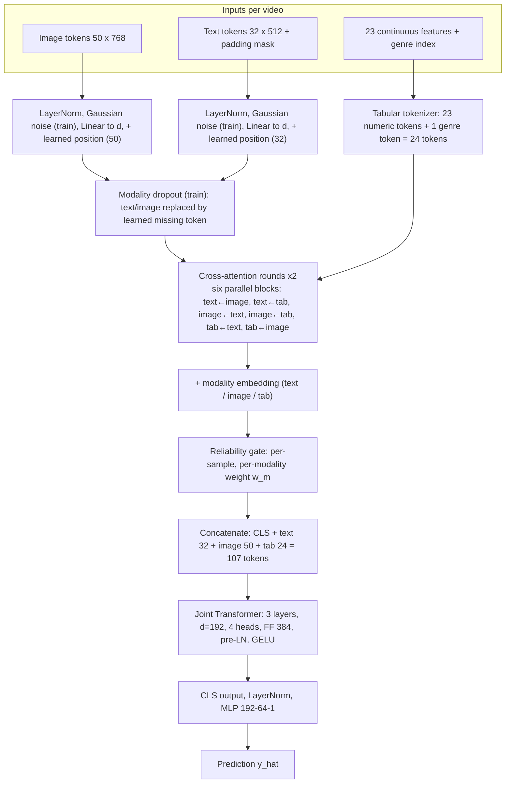

# Early Fusion (RATF) — Research Protocol

> **RATF** = _Reliability-Aware Token Fusion_: token-level early fusion for predicting the relative performance of YouTube videos from tabular metadata, titles, and thumbnails.
> This document is the single source of truth for the early-fusion experiments. All figures come from result files in the repository (`*_results.jsonl`, `summary_*.json`, `m6_final_runs.jsonl`, `optuna/stage*_full_*.json`, `final_cfg.json`) and from the code in `early_fusion/`.

**Branch:** `cleanup/m6-final` · **Release tag:** `m6-granular-v1.0` · **Dataset snapshot:** `c14dba895034fc4c`

> **Open items.** A few details cannot be verified from the files used to write this document (feature names, the token-cache generator, the final commit hash, the model's SHA-256, the verification output). They are listed in **Appendix B** and are the only placeholders left.

---

## 0. Executive Summary

| Item                                   | Value                                                                                                                                                                                                              |
| -------------------------------------- | ------------------------------------------------------------------------------------------------------------------------------------------------------------------------------------------------------------------ |
| Research question                      | Do token-level interactions between thumbnails, titles, and metadata (early fusion) outperform tuned late fusion?                                                                                                  |
| Evaluation protocol                    | Temporal 80/10/10 split, **without subscriber features** (`temporal_no_subs`). Metrics: Spearman (primary), AUC (label = `target > 0`), MAE on the log-ratio target                                                |
| Baseline                               | **M3′** (tuned late fusion, 40,865 parameters): test Spearman **0.2740 ± 0.0170** (3 seeds)                                                                                                                        |
| Final model                            | **M6 v2 granular**, configuration `c24` (Optuna Stage C, trial 24): 3,002,608 parameters per member; reliability gate **frozen at identity ("gate-off")**; **5-member seed ensemble**, refit on train+val          |
| Fair comparison (train-only, 5 seeds)  | single-model test Spearman **0.3725 ± 0.0147** (gate-off) and 0.3470 ± 0.0170 (gate-on) vs. M3′ 0.2740 → **+0.099 / +0.073**                                                                                       |
| Production refit (train+val, 5 seeds)  | single-model test Spearman **0.3791 ± 0.0111**; **ensemble 0.4313**, ensemble AUC 0.6899, ensemble MAE 0.4758                                                                                                      |

### Headline results (test set, 1,129 videos)

| Model                          | Trained on | Seeds   | Spearman (single model) | AUC (single)    | MAE (single)    | Spearman (ensemble) | AUC (ensemble) | MAE (ensemble) |
| ------------------------------ | ---------- | ------- | ----------------------: | --------------: | --------------: | ------------------: | -------------: | -------------: |
| M3′ late fusion (baseline)     | train      | 42–44   |         0.2740 ± 0.0170 | 0.6196 ± 0.0080 | 0.5006 ± 0.0038 |                 n/a |            n/a |            n/a |
| M6 granular `c24`, gate-on     | train      | 100–104 |         0.3470 ± 0.0170 | 0.6560 ± 0.0083 | 0.4859 ± 0.0106 |              0.3984 |         0.6803 |         0.4643 |
| M6 granular `c24`, gate-off    | train      | 100–104 |         0.3725 ± 0.0147 | 0.6684 ± 0.0067 | 0.4841 ± 0.0150 |              0.4297 |         0.6950 |         0.4578 |
| **M6 `c24`, gate-off (refit)** | train+val  | 100–104 |         0.3791 ± 0.0111 | 0.6659 ± 0.0103 | 0.5102 ± 0.0321 |          **0.4313** |     **0.6899** |     **0.4758** |

_(std = sample standard deviation across seeds, ddof = 1. "Ensemble" = the mean of the 5 members' raw predictions, scored once. M3′ has no ensemble result.)_

### Key findings

1. **Early fusion beats tuned late fusion under the same protocol.** On identical split hashes, single-model test Spearman is +0.073 (gate-on) to +0.099 (gate-off) above M3′ — 4–6× the seed standard deviation (Welch p ≈ 0.003 and 0.001; n = 5 vs. 3).
2. **The learned reliability gate did not help.** At the final configuration the `sigmoid2` gate saturates at its upper bound (≈ 2.0 for image and tabular in 5/5 seeds), i.e. it acts as a global ×2 scale rather than a relative modality weighting (§2.4). Freezing it at identity scored higher on test in 4 of 5 seeds (+0.026 mean, paired p = 0.058; §6.2).
3. **Modality dropout is what stabilises joint training** (without it, one of three seeds collapsed to 0.237; §4.3).
4. **Granular tokens beat pooled tokens** (validation 0.320 vs. 0.302, and ~4× lower seed variance; §4).
5. **Seed ensembling adds ≈ +0.05 Spearman** over a single model (0.347 → 0.398, 0.373 → 0.430, 0.379 → 0.431).
6. **Seed-to-seed variance is large** (identical configuration: validation 0.26–0.38 across seeds), so single-seed comparisons are unreliable; all selections in this work use multiple seeds and the final claims use five.

> **Read with the caveats in §8.** In particular: M3′ received a different tuning budget and has ~73× fewer parameters; no tuned tabular-only baseline exists, so the gain cannot be attributed to the image/text modalities specifically; and gate-off was chosen after seeing the test result of the gate ablation.

---

## 1. Dataset

### 1.1 Snapshot and Split

- Snapshot: `c14dba895034fc4c`, **N = 11,285** videos, **135 channels**.
- **Temporal** 80/10/10 split: train = **9,028**, val = **1,128**, test = **1,129**.
- Mode: `temporal_no_subs`, i.e. `drop_subs = true` (subscriber features are removed due to leakage risk).
- Split hashes (identical across all result files):

| Split | Hash               |
| ----- | ------------------ |
| train | `adb6377518e6233e` |
| val   | `1099f7a03511c7ea` |
| test  | `dccdabc759d22895` |

### 1.2 Channel Audit

- `channels.json`: 151 channels → **135 ingested**, 16 missing (verified via the API; see `missing_channels_audit.csv`).

| Category              | Count | Channel                                                                            |
| --------------------- | ----: | ---------------------------------------------------------------------------------- |
| `channel_not_found`   |     6 | @AlexG, @Empleman, @MaxMiller, @NikoOmilana, @ProHomeCooks, @TheEngineeringMindset |
| `no_videos_in_window` |     4 | @CompanyMan, @Hoog, @HowToMakeEverything, @LessonsFromTheScreenplay                |
| `all_shorts`          |     4 | @Garage54, @PracticalEngineering, @TomSka, @jasontheween                           |
| Unresolved errors     |     2 | @AdamRagusea (timeout), @Kraut (playlist 404)                                      |

**Conclusion:** no channels failed due to an ingestion bug; those 16 channels simply had no videos that passed the filters.

### 1.3 Text Token Length (L)

- Title-length distribution (11,285): p50 = 11, p90 = 19, p95 = 22, p99 = 29, max = 174.
- **L = 32** tokens → 0.59% of titles are truncated (≤ 1%), saving ~200 MB compared with L = 48.

### 1.4 Thumbnail Size Distribution

| Size            | Count | Percentage | Quality |
| --------------- | ----: | ---------: | ------- |
| 1280×720 (16:9) | 9,565 |      84.8% | maxres  |
| 640×480 (4:3)   | 1,710 |      15.2% | high    |
| 480×360 (4:3)   |    10 |       0.1% | medium  |

- Transform: `squash` to **224×224** (aspect ratio ignored), RGB mode.
- Note: ~15.3% of thumbnails are non-16:9, so the visual distortion caused by squashing differs.

### 1.5 Model Input Features

**Target (y)** — performance relative to the channel's own average:

```
target = log(1 + views) - log(1 + trailing_avg_views)
```

- `trailing_avg_views` = the average views of the previous 5 uploads on the same channel (a video never sees its own views). This definition follows the original repository's README; the code loads it via `compute_target(df["views"], df["trailing_avg_views"])` in `load_snapshot`.
- A target > 0 means the video performed better than its recent average. The binary label for **AUC** is `target > 0`.
- The target is on a log-ratio scale, so **target MAE** (log-ratio) and **view MAE/MAPE/RMSE** (after inverse transformation) are on two different scales.

**Model inputs:**

| Modality           | Shape                                                                  | Notes                                                                                                                                                                                   |
| ------------------ | ---------------------------------------------------------------------- | --------------------------------------------------------------------------------------------------------------------------------------------------------------------------------------- |
| Continuous tabular | **23**-dimensional vector (`n_cont = 23`)                              | `subscriber_count_at_upload` is **removed** (column index 0 of the tabular matrix); `trailing_avg_views` (log) **remains an input feature**; the scaler is fit on the training set only |
| Genre              | categorical index, **14** values (13 genres in training + 1 `unknown`) | categorical embedding                                                                                                                                                                   |
| Image              | **50 tokens × 768-d**                                                  | token cache (`data_snapshots/token_cache`)                                                                                                                                              |
| Text               | **32 tokens × 512-d** + padding mask                                   | L = 32 (see §1.3)                                                                                                                                                                       |

> ⚠️ **Open (Appendix B):** names of the 23 continuous features, contents of `features/target.py` (check whether it is identical to the original repository), and the token-cache generator (backbone, and whether the 50 tokens are 49 patches + CLS from CLIP ViT-B/32).

---

## 2. End-to-End Architecture and Mechanism

Everything in this section is taken from `early_fusion/models/ratf_m6_granular_v2.py`, `feature_tokenizer.py`, `fusion_transformer.py`, and `experiments/m6_core.py`.

### 2.1 Pipeline overview



Offline steps (done once): the snapshot is hash-verified at load, the target is computed, the tabular scaler is fit on the training rows only, the genre vocabulary is built from training rows only (index 0 = unknown), and the frozen image/text token cache is loaded to GPU memory (1,238 MB, float16).

### 2.2 Model forward pass (one member)



### 2.3 Token budget

| Stream            | Granular (final model)                         | Pooled variant                    |
| ----------------- | ---------------------------------------------- | --------------------------------- |
| `[CLS]`           | 1 learned token                                | 1                                 |
| Text              | **32** tokens (+ padding mask)                 | **1** (last valid token, "EOS")   |
| Image             | **50** tokens                                  | **1** (token index 0)             |
| Tabular           | **24** (23 numeric + 1 genre)                  | 24                                |
| **Total**         | **107**                                        | **27**                            |
| Positional emb.   | learned, image (50) and text (32)              | none                              |
| Parameters (default config, d = 128) | 1,004,874                   | 994,378                           |

- The **10,496-parameter** gap between granular and pooled is exactly the learned positional embeddings: (50 + 32) × 128 = 10,496.
- The token count is `n_cont + 1` for the tabular stream; with `n_cont = 23` (after dropping the subscriber column) this is 24. Older code comments that say "95 tokens / 12 tabular" were written for the default `n_continuous = 11` and do **not** describe the trained models.
- The final configuration (d = 192, 3 layers, 2 cross-attention rounds, FF multiplier 2) has **3,002,608** parameters per member.

### 2.4 Modules in order

1. **Tabular tokenizer (FT-Transformer style).** Each numeric feature `x_i` becomes its own token `x_i · w_i + b_i` with learned `w_i, b_i ∈ ℝᵈ` (init std 0.5 / 0.02); the genre index becomes one embedding token (init std 0.5). Dropout is applied to the tokens. There is no positional embedding: each feature already has its own weights.
2. **Image / text projection.** `LayerNorm(input_dim)` → Gaussian noise with std `emb_noise` (training only) → `Linear(input_dim → d)` → add a learned positional embedding (50 image positions, 32 text positions). Text padding is carried as a boolean mask (`True` = valid token).
3. **Modality dropout (training only).** Independently per sample, with probability `mod_dropout` each for text and for image (tabular is never dropped), the modality's tokens are replaced by a learned "missing" token. The dropped modality is also masked out of the joint attention and treated as unavailable by the gate.
4. **Cross-attention (`cross_attn_layers = 2` rounds; independent of `num_layers`).** In each round, six pre-LN attention blocks run **in parallel on the round's input streams**: text←image, text←tabular, image←text, image←tabular, tabular←text, tabular←image (first = query, second = key/value). Each block is `LN(q + α · Dropout(MHA(LN(q), LN(kv), LN(kv))))` with 4 heads and a **learnable residual scale α (init 0.1)**. The two outputs for each modality are averaged. Text padding is masked whenever text is the key/value.
5. **Modality embedding.** A learned vector per modality (text, image, tabular) is added after cross-attention.
6. **Reliability gate** (§2.5).
7. **Joint Transformer.** Sequence `[CLS, text(32), image(50), tabular(24)]` with a padding mask (text padding and any dropped modality). `nn.TransformerEncoder`, **pre-LN**, GELU, `d = 192`, 4 heads, feed-forward width `d × ff_mult = 384`, 3 layers, dropout 0.0789.
8. **Head.** Final `LayerNorm` on the `[CLS]` output → `Linear(192 → 64)` → GELU → Dropout → `Linear(64 → 1)` → scalar prediction.

### 2.5 Reliability gate

| Mode       | Formula (per sample, per modality `m`)                                                      | Range         |
| ---------- | ------------------------------------------------------------------------------------------- | ------------- |
| `sigmoid2` | `w_m = 2 · σ(logit_m)`                                                                      | (0, 2)        |
| `softmax`  | `w = n_avail · softmax(logits over available modalities)` (dropped modalities masked out)   | mean = 1      |

- **Input to the gate:** a pooled vector per modality — masked mean over valid text tokens, mean over the 50 image tokens, mean over the 24 tabular tokens.
- **Scorer (one per modality):** `LayerNorm(d) → Linear(d, max(d/4, 16)) → GELU → Dropout(gate_dropout = 0.1) → Linear(→1)`. The last layer is **zero-initialised**, so every logit is 0 at the start and `w ≡ 1` (`sigmoid2`) — the gate starts as the identity.
- **Application:** every token of modality `m` is multiplied by `w_m` for that sample (`sigmoid2`: a dropped modality gets `w = 0`).
- **Learning rate:** gate parameters form their own optimiser group with `lr × gate_lr_mult` and no weight decay. Optuna used `gate_lr_mult = 10`.
- **"Gate-off" (`gate_lr_mult = 0`).** With a zero-initialised last layer and a learning rate of 0, the logits stay at 0 and `w ≡ 1` exactly. This was verified in the logs: gate statistics are mean = 1.0, std = 0.0 for all three modalities in all five gate-off seeds. The module is still in the forward pass but is the identity; this is **not** a removal of the module.

**What the learned gate actually did (gate-on, final configuration, validation set; weights per modality):**

| Seed | Text mean (per-sample std) | Image mean (std) | Tabular mean (std) |
| ---: | -------------------------: | ---------------: | -----------------: |
|  100 |                1.95 (0.23) |       2.00 (0.00) |        2.00 (0.01) |
|  101 |                1.79 (0.42) |       2.00 (0.00) |        2.00 (0.00) |
|  102 |                1.99 (0.09) |       2.00 (0.00) |        2.00 (0.00) |
|  103 |                2.00 (0.00) |       1.99 (0.00) |        2.00 (0.01) |
|  104 |                1.97 (0.17) |       2.00 (0.00) |        2.00 (0.01) |

The weights sit at the upper bound of `2σ(·)` for nearly every sample: the gate learned a **global ×2 amplification**, not a differential reliability weighting. Gate weights must therefore **not** be read as modality importance.

### 2.6 Training recipe (final configuration)

| Parameter               | Value                                                        |
| ----------------------- | ------------------------------------------------------------ |
| Loss                    | `nn.HuberLoss()` (δ = 1) on the log-ratio target             |
| Optimiser               | AdamW (gate in its own group, weight decay 0 there)          |
| LR / weight decay       | 2.787e-4 / 0.01674                                           |
| Schedule                | constant after a 0.7-epoch linear warm-up                    |
| Batch size / grad clip  | 64 / 1.0                                                     |
| Max epochs / patience   | 60 / 15 (early stopping on validation Huber loss)            |
| EMA / rank loss         | disabled (`ema_decay = 0`, `rank_lambda = 0`)                |
| Regularisation          | dropout 0.0789 · embedding noise 0.1044 · modality dropout 0.0869 |
| Architecture            | d = 192 · 3 joint layers · 2 cross-attention rounds · FF ×2 · 4 heads |
| Precision / hardware    | fp32 with TF32 matmul · single CUDA GPU                      |

Two training protocols (set by `fit`):

- **`fit = train`** (sweeps, Optuna, confirmation, train-only finals): train on the train split, evaluate on validation each epoch, keep the weights of the epoch with the best validation Huber loss (`protocol = early_stop`). Best epochs of the final configuration: 6–8 (one seed 14).
- **`fit = trainval`** (production refit): train on train+val for a **fixed** number of epochs — **8**, the median best epoch of the gate-off train-only runs (`--refit-epochs 8`) — with no validation and no early stopping, and keep the final weights (`protocol = final`). The scaler and genre vocabulary are still fit on the training split only.

### 2.7 Model versions in this repository

| Version         | Gate                                                    | Status                                                                  |
| --------------- | ------------------------------------------------------- | ----------------------------------------------------------------------- |
| M6 v1 granular  | per-token `sigmoid`, factor `1 + α·r`, MLP init std 0.02 | gate did not learn (mean score r = 0.49–0.53 in every variant); kept as history (§4.0) |
| M6 v2 granular  | per-modality `sigmoid2` / `softmax`, zero-init last layer, modality dropout | **final architecture**                                    |
| M6 v2 pooled    | same gate and dropout, 1 token per modality             | reported as a comparison (§4)                                           |

---

## 3. Baseline: M3′ (Tuned Late Fusion)

Late fusion with **40,865 parameters**, AdamW, LR 1e-3, weight decay 1e-4, batch size 64, 5% warmup, gradient clipping 1.0, and up to 400 epochs. Seeds 42–44, mode `temporal_no_subs`.

|                Seed | Validation Spearman |       Test Spearman |            Test AUC |          Target MAE |             View MAE |           View MAPE |               View RMSE | Best epoch |
| ------------------: | ------------------: | ------------------: | ------------------: | ------------------: | -------------------: | ------------------: | ----------------------: | ---------: |
|                  42 |              0.3228 |              0.2853 |              0.6220 |              0.4978 |              631,069 |              0.5797 |               2,431,447 |          7 |
|                  43 |              0.3117 |              0.2822 |              0.6261 |              0.4990 |              599,817 |              0.5939 |               2,138,652 |          6 |
|                  44 |              0.2846 |              0.2545 |              0.6106 |              0.5050 |              613,970 |              0.5370 |               2,247,855 |          6 |
| **Mean ± std** | **0.3064 ± 0.0197** | **0.2740 ± 0.0170** | **0.6196 ± 0.0080** | **0.5006 ± 0.0038** | **614,952 ± 15,649** | **0.5702 ± 0.0296** | **2,272,651 ± 147,964** |            |

_(std = sample standard deviation, ddof = 1.)_

> **Original repository context (`avalon-py/yt-performance-predictor`).** Its README reports late fusion v1 (frozen CLIP, LR 2e-5, **with** subscriber count, chronological 80/10/10 split, **1,060** test rows, and a different data snapshot) with test Spearman of 0.30–0.33. The target definition is the same as in §1.5. However, those figures are **not a direct comparison**: the dataset, number of test rows, subscriber features, and LR differ. The official comparator in this document is M3′ on the same snapshot as M6. The same README also notes that `subscriber_count_at_upload` is actually the subscriber count **at present**, not when the video was published, supporting the decision to remove that feature.

> **The old M3′ result (test 0.3533) and all M0/M0b/M3/M4 baselines have been removed from this document.** Those figures came from a protocol predating `temporal_no_subs` and are not comparable with the results above. Only the figures in the table in §3 are valid.

---

## 4. M6 v2 Experiments: Granular vs. Pooled

All runs: `temporal_no_subs` split, `cross_attn_layers = 1`, **validation only evaluated** (`test_eval = false`). The test set was accessed only at the final stage.

### 4.0 Motivation: the v1 per-token gate did not learn

First M6 sweep on `temporal_no_subs` (validation only, 3 seeds, v1 per-token gate; source `m6_temporal_granular_results.jsonl`):

| Variant                | Parameters | Validation Spearman (mean ± std) | Mean val AUC | Best epochs  | Mean gate score _r_ |
| ---------------------- | ---------: | -------------------------------: | -----------: | ------------ | ------------------: |
| tabular only           |    594,627 |                  0.3060 ± 0.0088 |       0.6255 | 34 / 25 / 17 |          0.49–0.50  |
| tabular + text         |    732,423 |                  0.2642 ± 0.0275 |       0.6150 | 5 / 4 / 11   |          0.49–0.50  |
| tabular + image        |    732,423 |                  0.3157 ± 0.0146 |       0.6316 | 7 / 11 / 9   |          0.50–0.53  |
| full (image+text+tab)  |  1,003,853 |                  0.2964 ± 0.0464 |       0.6240 | 4 / 8 / 7    |          0.50–0.51  |

Gate scores stayed at ≈ 0.50 = σ(0) in every variant and seed: the v1 gate was effectively a no-op, and the multimodal variants stopped after only 4–11 epochs. Diagnosis from the code:

- the factor `1 + α·r` ranges over [1, 1 + α] and could never suppress a modality, only amplify it;
- the scoring MLP was initialised with weight std 0.02, so logits were ≈ 0 and nearly identical for all tokens;
- the warm-up (300 steps ≈ 2 epochs) consumed a large part of the 4–11 epochs available before overfitting.

v2 therefore (a) gates per **modality** instead of per token, (b) uses a range that can both suppress and amplify (`2σ` or `n·softmax`) with a zero-initialised last layer so training starts from the identity, (c) adds **modality dropout**, (d) gives the gate its own learning rate, and (e) shortens the warm-up to ~0.7 epoch.

### 4.1 Granular (1,004,874 parameters)

| Config                | Seed 42 | Seed 43 |    Seed 44 | **Validation Spearman (mean ± std)** | Mean validation AUC | Best epoch  |
| --------------------- | ------: | ------: | ---------: | -----------------------------------: | ------------------: | ----------- |
| softmax, md 0         |  0.3211 |  0.3146 | **0.2374** |                      0.2910 ± 0.0466 |              0.6186 | 9 / 7 / 3   |
| softmax, md 0.15      |  0.3113 |  0.3192 |     0.3173 |                      0.3159 ± 0.0041 |              0.6344 | 11 / 7 / 12 |
| **sigmoid2, md 0.15** |  0.3148 |  0.3240 |     0.3221 |                  **0.3203 ± 0.0048** |          **0.6363** | 11 / 7 / 12 |

### 4.2 Pooled (994,378 parameters)

| Config            | Seed 42 | Seed 43 | Seed 44 | **Validation Spearman (mean ± std)** | Mean validation AUC | Best epoch |
| ----------------- | ------: | ------: | ------: | -----------------------------------: | ------------------: | ---------- |
| sigmoid2, md 0.15 |  0.3228 |  0.2821 |  0.3013 |                      0.3021 ± 0.0204 |              0.6279 | 5 / 5 / 6  |
| softmax, md 0.15  |  0.3225 |  0.2825 |  0.3053 |                      0.3035 ± 0.0201 |              0.6283 | 5 / 5 / 6  |

### 4.3 Findings

1. **Modality dropout stabilizes training.** Without modality dropout (md 0), seed 44 collapsed to 0.2374 and stopped at epoch 3. With md 0.15, all three seeds were in the 0.311–0.324 range (std decreased from 0.0466 to ~0.004).
2. **Granular performs better and is much more stable than pooled.** Validation: 0.3203 ± 0.0048 vs. 0.3021 ± 0.0204. Pooled stopped very early (epochs 5–6), and variation across seeds was ~4× larger.
3. **`sigmoid2` is slightly better than `softmax`** on granular (0.3203 vs. 0.3159), but the 0.0044 difference is still within one standard deviation, so it **cannot yet be considered significant**. For pooled, the two are practically identical.
4. **The gate is inconsistent across seeds.** Average gate weights per modality vary (e.g., granular `sigmoid2` image gate: 1.25 / 1.40 / 1.95 for seeds 42 / 43 / 44, with per-sample std of only 0.02–0.10, nearly constant). This **must not** be interpreted as evidence that a modality is "more important"; interpreting the gate as an explanation requires separate verification (e.g., through modality ablation).
5. **The validation advantage over M3′ is small.** Best M6 granular validation score: 0.3203 vs. M3′ 0.3064 (difference +0.014, equivalent to < 1 M3′ standard deviation of 0.0197).

---

## 5. Configuration Selection (Optuna, 3 Stages) and Confirmation

### 5.1 Procedure

| Step                | Seeds           | Trained on | What is measured          | Purpose                                         |
| ------------------- | --------------- | ---------- | ------------------------- | ----------------------------------------------- |
| Tuning A, B, C      | 42, 43          | train      | validation only           | choose the configuration                        |
| Fresh-seed check    | 201, 202, 203   | train      | validation only           | check that Stage A gains survive new seeds      |
| Confirmation        | 44, 45, 46      | train      | validation only           | choose one candidate among six                  |
| Final (train-only)  | 100–104         | train      | validation **and test**   | numbers that are reported                       |
| Production refit    | 100–104         | train+val  | test only                 | the model that is deployed                      |

Tuning details (`tune_m6_optuna.py`):

- **Sampler:** TPE (multivariate, grouped), seed 0, 12 / 8 / 10 random start-up trials for Stages A / B / C. Search spaces are in Appendix A.
- **Trial score:** `mean(val Spearman over seeds 42, 43) − 0.5 · std` — a risk-adjusted score that penalises configurations that collapse on one seed.
- **Trial 0 of every stage is the previous stage's best configuration**, re-evaluated under identical conditions, so each stage reports an honest gain over its starting point.
- **Cost control:** if the first seed's score is below the 35th percentile of earlier first-seed scores (after ≥ 8 trials) or below 0.26, the second seed is skipped (trial pruned); a run whose best validation Spearman is still < 0.24 after epoch 8 is aborted.
- **Staging rationale:** with a few dozen trials TPE cannot cover > 10 dimensions reliably, so parameters are grouped by cause and effect: optimisation/regularisation (A) → architecture (B) → local refinement + gate (C).
- **Trials:** Stage A 40 (30 complete, 10 pruned), Stage B 24 (19 complete, 5 pruned), Stage C 24 (19 complete — 18 unique configurations — and 5 pruned). Stage B re-proposed one configuration three times (trials 17–19, identical results; the stage-B search space has only 48 combinations).
- The test set was **never** touched during tuning or confirmation (`test_eval = false`).

### 5.2 Stage results (seeds 42, 43; score = mean − 0.5·std)

**Stage A — optimisation / regularisation.** Starting point (trial 0, default configuration): score 0.3108 (mean 0.3176, std 0.0135).

| Rank | Trial | Score  | Mean   | Std    | Seed 42 | Seed 43 |
| ---: | ----: | -----: | -----: | -----: | ------: | ------: |
|    1 |    31 | 0.3447 | 0.3558 | 0.0222 |  0.3715 |  0.3401 |
|    2 |    27 | 0.3446 | 0.3475 | 0.0059 |  0.3434 |  0.3517 |
|    3 |    20 | 0.3409 | 0.3436 | 0.0053 |  0.3398 |  0.3473 |
|    4 |    30 | 0.3299 | 0.3347 | 0.0097 |  0.3279 |  0.3416 |
|    5 |    14 | 0.3261 | 0.3290 | 0.0057 |  0.3330 |  0.3249 |

Gain over trial 0: **+0.0339**. Trial 31 was carried into Stage B (higher LR, less dropout, constant schedule; EMA, rank loss and cosine schedule were not selected).

**Stage B — architecture.** Starting point (trial 0 = Stage-A trial 31 re-run): score 0.3447 — identical to its Stage-A value, confirming run determinism.

| Rank | Trial     | Score  | Mean   | Std    | Seed 42 | Seed 43 |
| ---: | --------- | -----: | -----: | -----: | ------: | ------: |
|    1 | 17 (= 18 = 19) | 0.3699 | 0.3770 | 0.0141 |  0.3869 |  0.3670 |
|    2 | 20        | 0.3651 | 0.3688 | 0.0074 |  0.3635 |  0.3740 |
|    3 | 12        | 0.3555 | 0.3594 | 0.0076 |  0.3540 |  0.3647 |

Gain: **+0.0252**. Winner: d = 192, 3 joint layers, 2 cross-attention rounds, FF multiplier 2.

**Stage C — local refinement + gate.** Starting point (trial 0 = Stage-B winner): score 0.3699 (mean 0.3770, std 0.0141, 2-seed ensemble 0.4116).

| Rank | Trial | Score  | Mean   | Std    | 2-seed ens. | Seed 42 | Seed 43 |
| ---: | ----: | -----: | -----: | -----: | ----------: | ------: | ------: |
|    1 |    24 | 0.3764 | 0.4002 | 0.0477 |      0.4469 |  0.4340 |  0.3665 |
|    2 |     0 | 0.3699 | 0.3770 | 0.0141 |      0.4116 |  0.3869 |  0.3670 |
|    3 |     6 | 0.3673 | 0.3680 | 0.0014 |      0.3825 |  0.3671 |  0.3690 |
|    4 |    14 | 0.3641 | 0.3762 | 0.0242 |      0.4012 |  0.3933 |  0.3591 |
|    5 |    23 | 0.3635 | 0.3677 | 0.0084 |      0.3851 |  0.3736 |  0.3617 |

Gain: only **+0.0065**, and almost entirely from seed 42 (trial 24: 0.4340 vs. 0.3869; seed 43 unchanged). Stage C therefore only _screens_ candidates; the decision is made on fresh seeds (§5.4).

**Parameters carried through the stages** (final = `final_cfg.json` = trial 24):

| Parameter                                   | Stage A winner | Stage B winner | Stage C winner (final) |
| ------------------------------------------- | -------------: | -------------: | ---------------------: |
| `d`                                         |            128 |            192 |                    192 |
| `num_layers` / `cross_attn_layers`          |          2 / 1 |          3 / 2 |                  3 / 2 |
| `ff_mult`                                   |              4 |              2 |                      2 |
| `dropout`                                   |         0.1177 |         0.1177 |             **0.0789** |
| `emb_noise`                                 |         0.0774 |         0.0774 |             **0.1044** |
| `mod_dropout`                               |         0.1214 |         0.1214 |             **0.0869** |
| `lr`                                        |       2.255e-4 |       2.255e-4 |           **2.787e-4** |
| `weight_decay`                              |        0.00737 |        0.00737 |            **0.01674** |
| `gate_mode` / `gate_dropout` / `gate_lr_mult` | sigmoid2 / 0.1 / 10 |     same |                   same |
| batch / clip / schedule / max epochs / patience | 64 / 1.0 / const / 60 / 15 | same |               same |

### 5.3 Phase 0 — refactor reproduction

Before tuning, the new unified pipeline (`m6_core.py`) was checked against the earlier sweep: default configuration, seeds 42/43/44 → validation 0.3153 / 0.3244 / 0.3218 (0.3205 ± 0.0047; ensemble 0.3473), versus 0.3148 / 0.3240 / 0.3221 in the sweep. After this check the data pipeline was moved to a GPU-resident store (faster, different shuffle order, TF32), so later numbers are **not bit-identical** to Phase 0: the same default configuration and seed 44 scored 0.3218 in Phase 0 and 0.2687 in the confirmation run. This ~0.05 per-seed movement under an unchanged configuration is the main reason all decisions use multiple seeds.

### 5.4 Fresh-seed check (seeds 201–203, validation)

| Configuration        | Seed 201 | Seed 202 | Seed 203 | Mean ± std      | Ensemble |
| -------------------- | -------: | -------: | -------: | --------------: | -------: |
| default              |   0.3009 |   0.2924 |   0.2309 | 0.2747 ± 0.0382 |   0.3001 |
| Stage-A trial 31     |   0.3836 |   0.3045 |   0.2640 | 0.3174 ± 0.0608 |   0.3705 |
| Stage-A trial 27     |   0.3789 |   0.2629 |   0.2832 | 0.3083 ± 0.0620 |   0.3460 |

The Stage-A gain over default persists on new seeds (+0.043 for trial 31), but with std ≈ 0.04–0.06 per configuration and n = 3 it is suggestive rather than conclusive; trial 31 and trial 27 are statistically indistinguishable.

### 5.5 Confirmation (seeds 44–46, validation only)

Selection rule fixed in advance: pick the candidate with the highest risk score (`mean − 0.5·std`) and adopt it over the default only if it beats the default by ≥ 0.005. The 95 % interval is a paired bootstrap over the 1,128 validation videos (2,000 resamples) of the ensemble-Spearman difference to the default; it reflects validation-sampling noise, not seed noise.

| Candidate                    | Mean ± std      | Risk   | Ensemble (3 seeds) | Δ ensemble vs. default [95 % CI] | Per-seed (44 / 45 / 46) |
| ---------------------------- | --------------: | -----: | -----------------: | -------------------------------: | ----------------------- |
| default (d=128, 2 layers)    | 0.2986 ± 0.0682 | 0.2645 |             0.3467 | —                                | 0.2687 / 0.2504 / 0.3766 |
| Stage-A trial 31 (d=128)     | 0.3552 ± 0.0181 | 0.3461 |             0.3833 | +0.0366 [+0.0094, +0.0650]       | 0.3343 / 0.3644 / 0.3668 |
| Stage-B winner (`c0`)        | 0.3298 ± 0.0601 | 0.2997 |             0.3760 | +0.0293 [−0.0025, +0.0595]       | 0.3642 / 0.3647 / 0.2604 |
| Stage-C trial 6 (`c6`)       | 0.3605 ± 0.0466 | 0.3373 |             0.3851 | +0.0384 [+0.0088, +0.0676]       | 0.3213 / 0.4120 / 0.3483 |
| **Stage-C trial 24 (`c24`)** | **0.3844 ± 0.0109** | **0.3790** |     **0.4190** | **+0.0723 [+0.0364, +0.1105]**   | 0.3722 / 0.3932 / 0.3878 |
| `c24`, gate frozen (gate-off) | 0.3785 ± 0.0418 | 0.3576 |             0.4216 | +0.0749 [+0.0415, +0.1080]       | 0.3807 / 0.4192 / 0.3357 |

**Outcome:** `c24` is the best candidate (risk +0.114 over default, and by far the most stable across seeds); it is adopted. The gate-off variant on these seeds was mixed: lower mean and risk (one weak seed, 0.3357) but a marginally higher ensemble — see §6.2 for the full gate ablation.

---

## 6. Final Results

All runs below use the configuration `final_cfg.json` (= `c24`). Seeds 100–104 were not used for any selection. The test set was opened under three ledger roles: `m6_final` (gate-on), `m6_gateoff` (gate-off ablation), `m6_refit` (production refit).

### 6.1 Train-only runs (5 seeds)

**Gate-on** (`gate_lr_mult = 10`; tag `final_m6_c24`; cfg hash `cd5ec2cb143868b9`; protocol `early_stop`):

| Seed | Val Spearman | Val AUC | Val MAE | Best epoch | Test Spearman | Test AUC | Test MAE |
| ---: | -----------: | ------: | ------: | ---------: | ------------: | -------: | -------: |
|  100 |       0.3914 |  0.6669 |  0.4813 |          6 |        0.3567 |   0.6562 |   0.4904 |
|  101 |       0.3672 |  0.6621 |  0.4897 |          6 |        0.3231 |   0.6470 |   0.4899 |
|  102 |       0.3657 |  0.6563 |  0.4839 |          6 |        0.3671 |   0.6696 |   0.4739 |
|  103 |       0.3942 |  0.6703 |  0.4807 |          6 |        0.3500 |   0.6547 |   0.4760 |
|  104 |       0.3858 |  0.6695 |  0.4887 |          7 |        0.3380 |   0.6528 |   0.4991 |
| **Mean ± std** | **0.3809 ± 0.0135** | 0.6650 ± 0.0058 | 0.4849 ± 0.0041 | — | **0.3470 ± 0.0170** | 0.6560 ± 0.0083 | 0.4859 ± 0.0106 |
| **Ensemble (5)** | 0.4289 | 0.6876 | — | — | **0.3984** | 0.6803 | 0.4643 |

**Gate-off** (`gate_lr_mult = 0`; tag `final_m6_c24_gateoff`; cfg hash `d0d0ca3e9a6d0740`; protocol `early_stop`):

| Seed | Val Spearman | Val AUC | Val MAE | Best epoch | Test Spearman | Test AUC | Test MAE |
| ---: | -----------: | ------: | ------: | ---------: | ------------: | -------: | -------: |
|  100 |       0.4069 |  0.6686 |  0.4821 |          8 |        0.3872 |   0.6613 |   0.4772 |
|  101 |       0.4153 |  0.6842 |  0.4990 |         14 |        0.3579 |   0.6631 |   0.5100 |
|  102 |       0.3578 |  0.6543 |  0.4817 |          6 |        0.3579 |   0.6680 |   0.4818 |
|  103 |       0.3750 |  0.6614 |  0.4822 |          6 |        0.3724 |   0.6718 |   0.4715 |
|  104 |       0.4076 |  0.6827 |  0.4830 |          8 |        0.3873 |   0.6778 |   0.4798 |
| **Mean ± std** | **0.3925 ± 0.0248** | 0.6702 ± 0.0131 | 0.4856 ± 0.0075 | — | **0.3725 ± 0.0147** | 0.6684 ± 0.0067 | 0.4841 ± 0.0150 |
| **Ensemble (5)** | 0.4456 | 0.6957 | — | — | **0.4297** | 0.6950 | 0.4578 |

Validation → test change (single-model mean): gate-on −0.034, gate-off −0.020, M3′ −0.032. The tuned model does not show a larger validation-to-test drop than the baseline, i.e. no sign of extra overfitting to the validation split.

### 6.2 Gate ablation

| Evidence                                         | Gate-off − gate-on                          | Test                                  |
| ------------------------------------------------ | ------------------------------------------- | ------------------------------------- |
| Test Spearman, seeds 100–104 (paired)            | +0.0305, +0.0348, −0.0092, +0.0224, +0.0493 | mean **+0.0256**; paired t p = 0.058; Wilcoxon p = 0.125; 4 of 5 seeds |
| Validation Spearman, seeds 100–104 (paired)      | +0.0155, +0.0481, −0.0079, −0.0192, +0.0218 | mean +0.0117; paired t p = 0.379       |
| Test ensemble (5 seeds)                          | 0.4297 vs. 0.3984                           | +0.031                                |
| Confirmation seeds 44–46, validation             | mean 0.3785 vs. 0.3844; ensemble 0.4216 vs. 0.4190 | mixed                           |

Reading: the learned gate shows **no benefit** and, on test, a borderline-significant tendency to be slightly harmful. Mechanistically, the learned gate saturates at ≈ 2 (§2.5), so gate-on vs. gate-off differs mainly by a global ×2 scale on all tokens entering the joint Transformer. **Disclosure:** the original plan designated gate-on as final and gate-off as an ablation; gate-off was adopted for deployment after this ablation (including its test result). With two options the selection bias is small but non-zero, so both variants are reported in full. The claim supported by the data is "the reliability gate, as implemented, did not improve performance" — not "the gate is harmful" and not "the gate is useful".

### 6.3 Production refit (train+val, gate-off, 5 seeds)

Tag `refit_m6_c24_gateoff` · cfg hash `ea9eafc5d2062447` · `fit = trainval`, **8 fixed epochs**, no validation · seeds 100–104 · test role `m6_refit`.

| Seed | Test Spearman | Test AUC | Test MAE |
| ---: | ------------: | -------: | -------: |
|  100 |        0.3916 |   0.6801 |   0.5228 |
|  101 |        0.3783 |   0.6639 |   0.4934 |
|  102 |        0.3886 |   0.6725 |   0.4833 |
|  103 |        0.3655 |   0.6565 |   0.5609 |
|  104 |        0.3714 |   0.6565 |   0.4905 |
| **Mean ± std** | **0.3791 ± 0.0111** | 0.6659 ± 0.0103 | 0.5102 ± 0.0321 |
| **Ensemble (5)** | **0.4313** | **0.6899** | **0.4758** |

- Pre-registered sanity floor for the refit ensemble: test Spearman ≥ 0.40 — **passed (0.4313)**.
- Compared with the train-only gate-off models, the refit moves the single-model mean by +0.0066 (paired p = 0.49): adding the validation period does **not** change test performance detectably. It is used for deployment because it uses the most recent data, a decision fixed before the run.
- Ranking quality (Spearman, AUC) is stable across seeds, but **target MAE varies widely per seed (0.483–0.561)**: individual refit members are not well calibrated in absolute level, and averaging five members brings MAE back to 0.4758. The model output should be used as a **ranking score**.

### 6.4 Metric definitions (`metrics` in `m6_core.py`)

| Metric   | Definition                                                                                          |
| -------- | --------------------------------------------------------------------------------------------------- |
| Spearman | rank correlation between predictions and the target (primary metric)                                |
| AUC      | `roc_auc_score(target > 0, prediction)` — can the score separate "above" from "below" recent average |
| MAE      | mean absolute error on the **log-ratio target scale**; comparable to M3′'s `test_mae_target`        |
| Ensemble | mean of the **raw predictions** of the 5 seeds, then each metric is computed once on the average    |

View-scale MAE / MAPE / RMSE exist only for M3′ (`test_mae_views`, `test_mape_views`, `test_rmse_views`); they were not computed for M6.

---

## 7. Final Comparison

| Model                           | Trained on | Seeds   | Val Spearman         | **Test Spearman**    | Test AUC | Test MAE | Δ test vs. M3′ | Welch p vs. M3′ |
| ------------------------------- | ---------- | ------- | -------------------: | -------------------: | -------: | -------: | -------------: | --------------: |
| M3′ late fusion                 | train      | 42–44   |      0.3064 ± 0.0197 |  **0.2740 ± 0.0170** |   0.6196 |   0.5006 |              — |               — |
| M6 `c24`, gate-on               | train      | 100–104 |      0.3809 ± 0.0135 |  **0.3470 ± 0.0170** |   0.6560 |   0.4859 |         +0.073 |           0.003 |
| M6 `c24`, gate-off              | train      | 100–104 |      0.3925 ± 0.0248 |  **0.3725 ± 0.0147** |   0.6684 |   0.4841 |         +0.099 |           0.001 |
| M6 `c24`, gate-off, **refit**   | train+val  | 100–104 |                  n/a |  **0.3791 ± 0.0111** |   0.6659 |   0.5102 |         +0.105 |           0.002 |
| M6 `c24`, gate-off, 5-seed **ensemble** (refit) | train+val | 100–104 | n/a | **0.4313** | 0.6899 | 0.4758 | not comparable (M3′ has no ensemble) | — |

- The fair like-for-like comparison is **single model vs. single model, both trained on train only**: M6 exceeds M3′ by +0.073 (gate-on) and +0.099 (gate-off) Spearman, with AUC +0.036 / +0.049 and lower MAE.
- The ensemble row must **not** be compared with M3′'s seed average. An M3′ ensemble was not computed.
- Welch tests use n = 5 vs. n = 3 seeds and are indicative only.

---

## 8. Limitations and Caveats

1. **One temporal split.** Reported standard deviations reflect seed variation only, not variation across time periods. The approximate sampling noise of a Spearman on 1,128–1,129 videos is ≈ 0.025–0.03.
2. **Test-set usage.** Tuning and confirmation used validation only. The test set was opened for three ledger roles (`m6_final`, `m6_gateoff`, `m6_refit`); `test_eval_ledger.jsonl` refuses a second configuration for the same role. The choice of gate-off for deployment was made after seeing the gate-ablation test result (§6.2), which introduces a small optimistic bias for the deployed variant.
3. **Validation is optimistic.** ~90 Optuna trials and the confirmation step all use the same 1,128 validation videos, and per-seed validation scores vary by 0.1 or more for an identical configuration. Validation numbers describe selection, not expected performance; the test numbers are the reported estimates. Ensemble validation scores are slightly more optimistic still because every member selects its epoch on that split.
4. **Baseline fairness.** M3′ has 40,865 parameters (M6 final: 3,002,608), a different and smaller tuning effort (not recorded in the result files), 3 seeds (M6: 5), and no ensemble. The headline gap should be read with those differences in mind.
5. **No tuned tabular-only (or single-modality) baseline for the final model.** The gain over M3′ cannot be attributed specifically to the image/text modalities rather than to a better-tuned transformer over tabular tokens. The only modality ablation is the early v1 sweep (§4.0, untuned, where tabular-only 0.3060 was on par with the full model 0.2964).
6. **The reliability gate did not help** (§2.5, §6.2). Gate weights do not measure modality importance.
7. **Large seed variance.** The same configuration ranges over 0.26–0.38 validation Spearman across seeds (§5.4–5.5). Single-seed results should not be trusted; ensembling reduces but does not remove this.
8. **Calibration.** Per-seed target MAE of refit members ranges 0.483–0.561 (§6.3). Use the output for ranking, not as a calibrated log-ratio estimate. View-scale errors were not evaluated for M6.
9. **Early and fixed epochs.** The final configuration peaks after ~6–8 epochs; the refit uses a fixed 8 epochs without validation safeguards.
10. **Provenance.** The result logs record `git_sha = f4c8ef7f…` with `git_dirty = true` — the code was not committed at run time. The released tag contains the code as committed afterwards; re-running from a clean checkout of the tag has not been done.
11. **Input boundary.** The model consumes **pre-computed** image/text tokens (the frozen token cache) and the processed tabular matrix. The token-cache generator is outside this package; scoring a new raw thumbnail/title requires running it first.
12. **No external comparison.** Results are compared only with M3′ on the same snapshot and split; no other group's numbers are used because their protocol cannot be verified from this repository.

---

## 9. Reproducibility and Deployment

### 9.1 Workflow and commands

| Phase                         | Command (run from repository root)                                                                                                                                      |
| ----------------------------- | ----------------------------------------------------------------------------------------------------------------------------------------------------------------------- |
| 0. Refactor check             | `python early_fusion/experiments/run_m6_config.py --seeds 42 43 44 --tag p0_repro`                                                                                      |
| 1–3. Tuning                   | `python early_fusion/experiments/tune_m6_optuna.py --stage A --n-trials 40` → `--stage B --n-trials 24` → `--stage C --n-trials 24`                                      |
| 4. Confirmation               | `scripts/run_phase4_confirm.bat`, then `python early_fusion/experiments/analyze_confirm.py --baseline confirm_default --candidates confirm_c24 confirm_c0_stageB confirm_c6 confirm_stageA_t31 --extra confirm_c24_gateoff --gate-pair confirm_c24 confirm_c24_gateoff` |
| 5. Final (train-only)         | `scripts/run_phase5_final.bat` (freezes `final_cfg.json`, runs gate-on and gate-off on seeds 100–104 with `--eval-test`)                                                 |
| 6. Production refit           | `python early_fusion/experiments/run_m6_config.py --config early_fusion/results/final_cfg.json --set gate_lr_mult=0 --fit trainval --refit-epochs 8 --seeds 100 101 102 103 104 --eval-test --test-role m6_refit --save-preds --save-ckpt --tag refit_m6_c24_gateoff` |
| 7. Package                    | `python early_fusion/experiments/package_final_model.py --tag refit_m6_c24_gateoff --seeds 100 101 102 103 104 --out early_fusion/models/final/m6_granular_ensemble_v1.pt`  |
| 8. Verify                     | `python early_fusion/experiments/verify_final_model.py --model early_fusion/models/final/m6_granular_ensemble_v1.pt --tag refit_m6_c24_gateoff`                          |

### 9.2 Fixed identifiers

| Item                         | Value                                                                                  |
| ---------------------------- | -------------------------------------------------------------------------------------- |
| Snapshot                     | `c14dba895034fc4c`                                                                     |
| Split hashes                 | train `adb6377518e6233e` · val `1099f7a03511c7ea` · test `dccdabc759d22895`            |
| Config hashes                | gate-on `cd5ec2cb143868b9` · gate-off `d0d0ca3e9a6d0740` · refit `ea9eafc5d2062447`    |
| Seeds                        | tuning 42, 43 · confirmation 44, 45, 46 · fresh check 201–203 · final/refit 100–104    |
| Run logs' git SHA            | `f4c8ef7f84a1d6f3312da1726b098947e8d9f780` (`git_dirty = true`)                        |
| Release tag / code commit    | `m6-granular-v1.0` · commit `<fill in after tagging: git rev-parse --short HEAD>`      |

### 9.3 Deployed artefact

- **File:** `early_fusion/models/final/m6_granular_ensemble_v1.pt` — one file holding the configuration, the tabular scaler, the genre vocabulary, and five state dictionaries (seeds 100–104, trained on train+val, 8 epochs each, gate frozen at identity). Not stored in git (see `.gitignore`); distributed as a GitHub Release asset.
- **Companion:** `m6_granular_ensemble_v1.json` — human-readable summary with the file's SHA-256, configuration, lineage and refit metrics. **SHA-256:** `<copy from the .json file>`.
- **Loading:** the file contains scikit-learn objects (the scaler) and must be loaded with `weights_only=False`; only load a file whose SHA-256 matches the companion JSON.
- **Inference module:** `early_fusion/models/m6_ensemble.py`.

```python
from early_fusion.models.m6_ensemble import M6Ensemble

ens = M6Ensemble.load("early_fusion/models/final/m6_granular_ensemble_v1.pt")
cont, genre = ens.prepare_tabular(df)                      # df: rows in snapshot format
score, members = ens.predict(image_tokens, text_tokens, text_mask, cont, genre,
                             return_members=True)           # score: mean of the 5 members
```

- **Inputs:** image tokens `(n, 50, 768)`, text tokens `(n, 32, 512)`, text mask `(n, 32)` (`True` = valid), continuous `(n, 23)`, genre index `(n,)` (0 = unknown).
- **Output:** one score per video — the predicted log-ratio of views to the trailing average; interpret it as a **ranking** (§8.8). The spread across members (`members.std(0)`) can serve as an uncertainty indicator.
- **Verification:** `verify_final_model.py` checks that (1) the file loads, (2) member predictions on the test split equal the predictions stored by the refit run (tolerance 1e-3, Spearman 1e-4), and (3) `prepare_tabular` reproduces the training tensors. Record the outcome in Appendix B before release.

### 9.4 Repository map (`early_fusion/`)

| Path                                         | Role                                                                      |
| -------------------------------------------- | ------------------------------------------------------------------------- |
| `splits/`                                    | canonical `temporal_no_subs` split (hashes in §9.2)                       |
| `models/ratf_m6_granular_v2.py`              | final architecture                                                        |
| `models/ratf_m6_pooled_v2.py`                | pooled comparison variant                                                 |
| `models/ratf_m6_granular.py`                 | v1 (per-token gate; history, §4.0)                                        |
| `models/m6_ensemble.py`                      | inference for the packaged ensemble                                       |
| `models/final/`                              | companion JSON (model `.pt` is a release asset, not in git)               |
| `experiments/m6_core.py`                     | data loading, `train_one`, metrics (shared by all stages)                 |
| `experiments/tune_m6_optuna.py`              | staged Optuna search                                                      |
| `experiments/run_m6_config.py`               | multi-seed runner: confirmation, final, refit, with the test-eval ledger  |
| `experiments/analyze_confirm.py`             | confirmation table + bootstrap + decision rule                            |
| `experiments/package_final_model.py`, `verify_final_model.py` | packaging and verification                               |
| `experiments/train_m6_temporal_*.py`         | per-variant trainers used for the §4 sweeps                               |
| `experiments/train_m3_prime.py`              | M3′ baseline on `temporal_no_subs`                                        |
| `results/optuna/`                            | per-stage best / top-3 configurations, per-run tuning log                 |
| `results/m6_final_runs.jsonl`, `summary_*.json`, `test_eval_ledger.jsonl` | run records, summaries, test-access ledger  |
| `scripts/`                                   | `run_phase4_confirm.bat`, `run_phase5_final.bat`                          |

### 9.5 Result files used as sources

| File                                                         | Contents                                                          |
| ------------------------------------------------------------ | ----------------------------------------------------------------- |
| `m3_prime_results.jsonl`                                     | M3′, 3 seeds, validation + test, view-scale metrics               |
| `m6_temporal_granular_results.jsonl`                         | v1 sweep (§4.0)                                                   |
| `m6v2_temporal_granular_results.jsonl`, `…_pooled_results.jsonl` | v2 sweeps (§4)                                                |
| `optuna/stageA/B/C_full_best.json`, `_top3.json`             | best configurations per stage                                     |
| `m6_final_runs.jsonl`                                        | every Phase 0–6 run (per seed: scores, config, protocol, git info) |
| `summary_p0_repro`, `summary_a_check_*`, `summary_confirm_*`, `summary_final_*`, `summary_refit_*` | per-tag summaries (§5–§6) |
| `final_cfg.json`                                             | final configuration (= Stage-C trial 24)                          |

---

## Appendix A. Optuna Search Spaces

| Stage | Parameter            | Space                                                                                                         |
| ----- | -------------------- | ------------------------------------------------------------------------------------------------------------- |
| A     | `lr`                 | log-uniform [3e-5, 3e-4]                                                                                      |
| A     | `weight_decay`       | log-uniform [1e-3, 1e-1]                                                                                      |
| A     | `batch_size`         | {64, 128}                                                                                                     |
| A     | `schedule`           | {constant (max 60 epochs, early stop), cosine (horizon ∈ {15, 20, 30, 40})}                                   |
| A     | `dropout`            | uniform [0.10, 0.35]                                                                                          |
| A     | `emb_noise`          | uniform [0.00, 0.10]                                                                                          |
| A     | `mod_dropout`        | uniform [0.00, 0.30]                                                                                          |
| A     | `ema_decay`          | {0, 0.99, 0.995}                                                                                              |
| A     | `rank_lambda`        | {0, 0.1, 0.3} (weight of an auxiliary pairwise ranking loss)                                                  |
| B     | `d`                  | {64, 96, 128, 192}                                                                                            |
| B     | `num_layers`         | {1, 2, 3}                                                                                                     |
| B     | `cross_attn_layers`  | {1, 2}                                                                                                        |
| B     | `ff_mult`            | {2, 4}                                                                                                        |
| C     | `lr`                 | log-uniform, ×[0.5, 2] around the Stage-B value                                                               |
| C     | `weight_decay`       | log-uniform, ×[0.3, 4]                                                                                        |
| C     | `dropout`            | ±0.15 around base, clipped to [0.05, 0.40]                                                                    |
| C     | `emb_noise`          | ±0.05, clipped to [0, 0.3]                                                                                    |
| C     | `mod_dropout`        | ±0.10, clipped to [0, 0.5]                                                                                    |
| C     | `ema_decay`          | {0, 0.99, 0.995} ∪ base                                                                                       |
| C     | `rank_lambda`        | {0, 0.05, 0.1, 0.2, 0.4, 0.8} ∪ base                                                                          |
| C     | `gate_lr_mult`       | {0, 3, 10, 30} ∪ base                                                                                         |
| C     | `gate_dropout`       | {0, 0.1, 0.3} ∪ base                                                                                          |

Final configuration (`final_cfg.json`, gate-on as tuned; the deployed refit sets `gate_lr_mult = 0`):

```json
{
  "d": 192, "num_layers": 3, "cross_attn_layers": 2, "ff_mult": 2,
  "dropout": 0.07893573217275765, "emb_noise": 0.1044028039976821, "mod_dropout": 0.08691696230188581,
  "gate_mode": "sigmoid2", "gate_dropout": 0.1, "gate_lr_mult": 10.0,
  "lr": 0.0002786501522196209, "weight_decay": 0.01673939258862265, "batch_size": 64, "grad_clip": 1.0,
  "schedule": "const", "epochs": 60, "patience": 15, "warmup_epochs": 0.7, "lr_min_frac": 0.01,
  "ema_decay": 0.0, "rank_lambda": 0.0
}
```

---

## Appendix B. Open Items (fill in from the repository, not from memory)

- [ ] Names of the 23 continuous features — `python -c "from models.dataset import TABULAR_LOG_COLS, TABULAR_NUMERIC_COLS, TABULAR_BOOL_COLS as B; print(TABULAR_LOG_COLS, TABULAR_NUMERIC_COLS, B)"` (the subscriber column is removed after construction)
- [ ] Token-cache generator: image/text backbone and origin of the 50 image tokens (CLS + 49 patches?) — the generator is not in the files used for this document
- [ ] `git diff upstream/main -- features/target.py` (is the target definition identical to the original repository?)
- [ ] Output of `verify_final_model.py` (expected: `HASIL VERIFIKASI: LULUS`)
- [ ] SHA-256 of `m6_granular_ensemble_v1.pt` and the code commit hash (§9.2–9.3)
- [ ] M3′ tuning budget (number of trials / grid) for the fairness note in §8.4
- [ ] Whether to add a tuned tabular-only baseline (§8.5)
